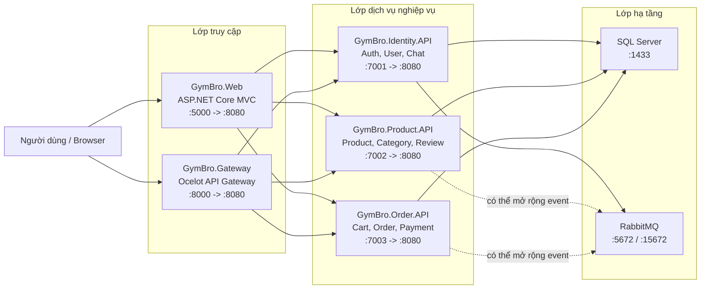
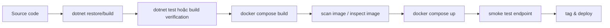

# CHƯƠNG 3. ĐỀ XUẤT MÔ HÌNH

Chương này đề xuất mô hình đóng gói và triển khai container cho hệ thống GymBro trên nền tảng Docker. Trọng tâm của mô hình không chỉ là làm cho ứng dụng chạy được trong container, mà còn tạo ra một quy trình có thể so sánh, đánh giá và tái sử dụng cho các dự án ASP.NET Core/.NET có cấu trúc tương tự.

Qua khảo sát mã nguồn, GymBro hiện là hệ thống thương mại điện tử bán đồ gym được tổ chức theo hướng nhiều dịch vụ. Các thành phần chính gồm `GymBro.Web`, `GymBro.Gateway`, `GymBro.Identity.API`, `GymBro.Product.API`, `GymBro.Order.API`, các project dùng chung như `GymBro.Contracts`, `GymBro.Core`, `GymBro.Infrastructure`, `GymBro.Service`, cùng các dịch vụ hạ tầng `SQL Server` và `RabbitMQ`. Các Dockerfile ở thư mục gốc đã sử dụng multi-stage build cơ bản, nhưng vẫn có thể nâng cấp thêm về cache build, quyền runtime, quản lý secrets và hardening khi chạy bằng Docker Compose.

Vì vậy, mô hình nghiên cứu trong chương này gồm hai hướng:

- **Baseline single-stage:** mô hình đối chứng, cố tình xây dựng image bằng một stage duy nhất để thấy rõ rủi ro về kích thước image, SDK, source code và quyền root trong runtime.
- **Secure multi-stage build:** mô hình đề xuất, tách giai đoạn restore, build, test, publish và runtime; đồng thời kết hợp non-root user, biến môi trường, volume, network nội bộ và runtime hardening.

## 3.1. Kiến trúc triển khai tổng thể

### 3.1.1. Kiến trúc triển khai của GymBro

Trong môi trường Docker, GymBro được đề xuất triển khai theo mô hình nhiều container. Mỗi thành phần chính của hệ thống được đóng gói thành một image riêng và chạy như một service riêng trong Docker Compose.



Các thành phần trong mô hình:

| Thành phần | Vai trò | Cổng ngoài đề xuất | Cổng trong container |
| --- | --- | --- | --- |
| `gymbro_web` | Giao diện MVC cho khách hàng và admin | `5000` | `8080` |
| `gateway` | API Gateway định tuyến đến các API nội bộ | `8000` | `8080` |
| `identity_api` | Đăng ký, đăng nhập, quản lý người dùng, SignalR chat, email event | `7001` | `8080` |
| `product_api` | Sản phẩm, danh mục, đánh giá, nhà cung cấp | `7002` | `8080` |
| `order_api` | Giỏ hàng, đơn hàng, thanh toán, wishlist | `7003` | `8080` |
| `db` | SQL Server lưu dữ liệu nghiệp vụ | `1433` | `1433` |
| `rabbitmq` | Message broker cho event bất đồng bộ | `5672`, `15672` | `5672`, `15672` |

Trong triển khai hiện tại, `docker-compose.yml` đã khai báo các service trên cùng một bridge network là `gymbro_network_multi`. Các container gọi nhau bằng tên service nội bộ như `db`, `rabbitmq`, `identity_api`, `product_api`, `order_api`. Cách này giúp ứng dụng không phụ thuộc vào địa chỉ IP tĩnh và phù hợp với cơ chế service discovery cơ bản của Docker Compose.

Ví dụ, connection string của các API không trỏ đến `localhost`, mà trỏ đến SQL Server bằng hostname nội bộ:

```text
Server=db;Database=GymBro_Product;User Id=sa;Password=...;TrustServerCertificate=True
```

Tương tự, các service kết nối RabbitMQ bằng hostname:

```text
RabbitMQ__HostName=rabbitmq
```

### 3.1.2. Nguyên tắc triển khai đề xuất

Mô hình triển khai tổng thể được xây dựng trên các nguyên tắc sau:

| Nguyên tắc | Ý nghĩa trong GymBro |
| --- | --- |
| Tách container theo chức năng | Web, Gateway, Identity, Product, Order, SQL Server và RabbitMQ chạy độc lập |
| Tách build-time khỏi runtime | SDK chỉ xuất hiện trong stage build, không nằm trong image chạy thật |
| Cấu hình qua environment variables | Connection string, URL service, RabbitMQ host và môi trường chạy được truyền từ Compose |
| Không nhúng secrets vào image | Image không chứa mật khẩu database, JWT key hoặc SMTP password |
| Dùng network nội bộ | Các API và hạ tầng giao tiếp qua bridge network, hạn chế mở cổng không cần thiết |
| Lưu dữ liệu bằng volume | SQL Server dùng volume để dữ liệu không mất khi container bị xóa |
| Ưu tiên least privilege | Container ứng dụng nên chạy bằng user thường, không chạy bằng `root` |
| Có bước kiểm thử trước deploy | Build solution, chạy test nếu có, chạy smoke test sau khi container khởi động |

### 3.1.3. Công thức Docker hóa cho các dự án ASP.NET Core tương tự

Từ trường hợp GymBro, có thể khái quát quy trình Docker hóa cho một dự án ASP.NET Core nhiều service như sau:

```text
Dự án .NET nhiều service
        |
        v
Xác định entry point chạy được
        |
        v
Tạo Dockerfile cho từng entry point
        |
        v
Đưa các dependency hạ tầng vào docker-compose
        |
        v
Khai báo network, volume, environment variables
        |
        v
Build image -> Test -> Scan -> Deploy
```

Có thể biểu diễn mô hình tổng quát:

```text
System = AppServices + InfrastructureServices + Network + Volumes + Configuration
```

Trong đó:

- `AppServices`: các service do nhóm phát triển, ví dụ `GymBro.Web`, `GymBro.Identity.API`, `GymBro.Product.API`.
- `InfrastructureServices`: các service hạ tầng, ví dụ `SQL Server`, `RabbitMQ`, `Redis`.
- `Network`: bridge network để các container gọi nhau bằng tên service.
- `Volumes`: nơi lưu dữ liệu bền vững như database, ảnh upload, data protection keys.
- `Configuration`: biến môi trường, file `.env`, secrets hoặc config bên ngoài.

Công thức cho một Dockerfile .NET an toàn hơn:

```text
Image(service) =
    Restore dependencies
    -> Build source code
    -> Run tests
    -> Publish artifact
    -> Copy artifact vào runtime image
    -> Run bằng non-root user
```

Công thức cho một service trong Docker Compose:

```yaml
service_name:
  build:
    context: .
    dockerfile: Path/To/Dockerfile
    target: final
  image: registry/project/service:tag
  environment:
    ASPNETCORE_ENVIRONMENT: Production
    ConnectionStrings__DefaultConnection: ${CONNECTION_STRING}
  depends_on:
    dependency_service:
      condition: service_started
  ports:
    - "host_port:8080"
  networks:
    - app_network
  restart: unless-stopped
```

Với dự án tương tự GymBro, quy tắc thực hành là:

1. Mỗi project có thể chạy độc lập bằng `dotnet run` thì nên có Dockerfile riêng.
2. Những project thư viện như `Core`, `Contracts`, `Infrastructure`, `Service` không cần container riêng, nhưng phải được copy đúng trong stage `restore`.
3. Không dùng `localhost` để các container gọi nhau; dùng tên service trong Compose.
4. Không hard-code mật khẩu trong Dockerfile hoặc image.
5. Chỉ publish cổng thật sự cần truy cập từ bên ngoài.
6. Có `.dockerignore` để loại `bin`, `obj`, `.git`, `.vs`, file tạm và tài nguyên không cần thiết khỏi build context.
7. Với production, nên dùng `.env`, Docker secrets hoặc secret manager thay vì để mật khẩu trực tiếp trong `docker-compose.yml`.

## 3.2. Mô hình Dockerfile (Baseline - Single-stage)

### 3.2.1. Mục đích của mô hình baseline

Mặc dù các Dockerfile hiện tại của GymBro đã dùng multi-stage build cơ bản, nghiên cứu vẫn cần một mô hình đối chứng để so sánh. Mô hình baseline được xây dựng theo kiểu single-stage: toàn bộ quá trình restore, build, publish và runtime diễn ra trong cùng một image.

Mục đích của baseline là làm rõ các vấn đề thường gặp khi Docker hóa ứng dụng .NET theo cách đơn giản:

- Image runtime chứa cả .NET SDK.
- Source code và file trung gian có thể còn tồn tại trong image cuối.
- Image có nhiều package hơn mức cần thiết.
- Container thường chạy bằng user mặc định, có thể là `root`.
- Không có ranh giới rõ giữa môi trường build và môi trường chạy thật.

Trong báo cáo này, `GymBro.Web` được dùng làm ví dụ đại diện vì đây là thành phần người dùng truy cập trực tiếp. Cách viết single-stage tương tự cũng có thể áp dụng cho `GymBro.Identity.API`, `GymBro.Product.API`, `GymBro.Order.API` hoặc `GymBro.Gateway`.

### 3.2.2. Dockerfile baseline minh họa

```dockerfile
FROM mcr.microsoft.com/dotnet/sdk:8.0

WORKDIR /src

COPY . .

WORKDIR /src/GymBro.Web

RUN dotnet restore "GymBro.Web.csproj"
RUN dotnet publish "GymBro.Web.csproj" -c Release -o /app/publish /p:UseAppHost=false

WORKDIR /app/publish

EXPOSE 8080

ENTRYPOINT ["dotnet", "GymBro.Web.dll"]
```

Nếu áp dụng cho `GymBro.Product.API`, chỉ cần thay thư mục làm việc và file DLL cuối:

```dockerfile
WORKDIR /src/GymBro.Product.API
RUN dotnet restore "GymBro.Product.API.csproj"
RUN dotnet publish "GymBro.Product.API.csproj" -c Release -o /app/publish /p:UseAppHost=false
ENTRYPOINT ["dotnet", "GymBro.Product.API.dll"]
```

### 3.2.3. Phân tích baseline

Mô hình baseline có ưu điểm là ngắn, dễ hiểu, phù hợp để người mới học Docker thấy được ứng dụng có thể chạy trong container như thế nào. Tuy nhiên, khi xét theo mục tiêu triển khai thực tế và bảo mật container, mô hình này có nhiều hạn chế.

| Tiêu chí | Đặc điểm của baseline single-stage |
| --- | --- |
| Base image | Dùng `mcr.microsoft.com/dotnet/sdk:8.0` cho cả build và runtime |
| Thành phần runtime | Chứa SDK, compiler, NuGet cache, source code và artifact |
| Kích thước image | Thường lớn do SDK nặng hơn runtime image |
| Bề mặt tấn công | Cao hơn vì có nhiều công cụ và package không cần khi chạy |
| Cache build | Kém hiệu quả vì `COPY . .` trước `dotnet restore` |
| Secrets | Dễ bị cấu hình sai nếu copy cả file development hoặc file nhạy cảm |
| Quyền chạy | Không khai báo `USER`, có nguy cơ chạy bằng `root` |
| Phù hợp production | Không phù hợp |

Điểm yếu quan trọng nhất của baseline là image cuối không chỉ chứa những gì ứng dụng cần để chạy. Nó chứa cả môi trường dùng để xây dựng ứng dụng. Đối với .NET, môi trường build cần SDK, còn môi trường chạy thật thường chỉ cần ASP.NET Core runtime. Nếu giữ SDK trong image runtime, image vừa lớn hơn vừa có nhiều thành phần có thể trở thành điểm bị khai thác khi xuất hiện lỗ hổng.

Do đó, baseline chỉ nên được dùng làm mô hình đối chứng trong nghiên cứu, không nên dùng làm phương án triển khai cuối cùng.

## 3.3. Mô hình Dockerfile (Secure Multi-stage Build - Tối ưu theo hướng bảo mật)

### 3.3.1. Ý tưởng của mô hình đề xuất

Secure Multi-stage Build là mô hình mở rộng từ multi-stage build truyền thống. Multi-stage build thông thường tập trung vào việc tách image build và image runtime. Secure Multi-stage Build tiếp tục bổ sung các yếu tố hardening để image cuối gọn hơn, ít quyền hơn và ít chứa thành phần nhạy cảm hơn.

Trong GymBro, mô hình này phù hợp vì mỗi service .NET đều có cấu trúc tương tự:

```text
Project chạy được
    + Project thư viện dùng chung
    + NuGet packages
    + appsettings / environment variables
    + output publish
```

Mô hình đề xuất gồm các stage:

| Stage | Mục đích |
| --- | --- |
| `restore` | Copy file `.csproj` trước, restore NuGet packages và tận dụng Docker cache |
| `build` | Copy toàn bộ source code và build ở chế độ Release |
| `test` | Chạy unit/integration test nếu project có test |
| `publish` | Tạo artifact tối giản bằng `dotnet publish` |
| `final` | Dùng runtime image, copy artifact đã publish, xóa file thừa và chạy non-root |

Các Dockerfile hiện tại ở root đã có hai stage chính là `build` và runtime. Mô hình đề xuất bổ sung thêm các cải tiến:

- Tách riêng bước `restore` bằng cách copy các file `.csproj` trước.
- Không `COPY . .` quá sớm, nhằm tăng hiệu quả cache.
- Có hook cho stage `test`.
- Không copy SDK, source code, `bin`, `obj`, `.git` sang image cuối.
- Xóa file debug như `.pdb` và file cấu hình development khỏi final image.
- Tạo user thường và chạy ứng dụng bằng `USER`.
- Kết hợp Compose hardening như `read_only`, `tmpfs`, `cap_drop` và `no-new-privileges`.

### 3.3.2. Dockerfile secure multi-stage cho GymBro.Web

Mẫu sau minh họa mô hình đề xuất cho `GymBro.Web`. Do `GymBro.Web` tham chiếu `GymBro.Service`, còn `GymBro.Service` tham chiếu `GymBro.Contracts` và `GymBro.Infrastructure`, stage `restore` cần copy đủ các file project liên quan.

```dockerfile
FROM mcr.microsoft.com/dotnet/sdk:8.0 AS restore
WORKDIR /src

COPY ["GymBro.Web/GymBro.Web.csproj", "GymBro.Web/"]
COPY ["GymBro.Service/GymBro.Service.csproj", "GymBro.Service/"]
COPY ["GymBro.Contracts/GymBro.Contracts.csproj", "GymBro.Contracts/"]
COPY ["GymBro.Infrastructure/GymBro.Infrastructure.csproj", "GymBro.Infrastructure/"]
COPY ["GymBro.Core/GymBro.Core.csproj", "GymBro.Core/"]

RUN dotnet restore "GymBro.Web/GymBro.Web.csproj"

FROM restore AS build
COPY . .
WORKDIR /src/GymBro.Web

RUN dotnet build "GymBro.Web.csproj" -c Release --no-restore -o /app/build

FROM build AS test
WORKDIR /src
# Khi bổ sung test project vào solution root, kích hoạt lệnh sau:
# RUN dotnet test "GymBro.Tests/GymBro.Tests.csproj" -c Release --no-restore

FROM build AS publish
WORKDIR /src/GymBro.Web

RUN dotnet publish "GymBro.Web.csproj" \
    -c Release \
    --no-restore \
    -o /app/publish \
    /p:UseAppHost=false \
    /p:DebugType=None \
    /p:DebugSymbols=false

FROM mcr.microsoft.com/dotnet/aspnet:8.0 AS final
WORKDIR /app

ENV ASPNETCORE_URLS=http://+:8080
EXPOSE 8080

COPY --from=publish /app/publish .

RUN rm -f ./*.pdb ./appsettings.Development.json \
    && addgroup --system gymbro \
    && adduser --system --ingroup gymbro gymbro \
    && mkdir -p /app/wwwroot/Content/Images /home/gymbro/.aspnet/DataProtection-Keys \
    && chown -R gymbro:gymbro /app /home/gymbro

USER gymbro

ENTRYPOINT ["dotnet", "GymBro.Web.dll"]
```

### 3.3.3. Dockerfile secure multi-stage cho các API

Các API như `GymBro.Identity.API`, `GymBro.Product.API`, `GymBro.Order.API` và `GymBro.Gateway` có thể dùng cùng một công thức. Khác biệt chính nằm ở project cần restore, project cần publish và DLL entrypoint.

Ví dụ với `GymBro.Product.API`:

```dockerfile
FROM mcr.microsoft.com/dotnet/sdk:8.0 AS restore
WORKDIR /src

COPY ["GymBro.Product.API/GymBro.Product.API.csproj", "GymBro.Product.API/"]
COPY ["GymBro.Infrastructure/GymBro.Infrastructure.csproj", "GymBro.Infrastructure/"]
COPY ["GymBro.Core/GymBro.Core.csproj", "GymBro.Core/"]
COPY ["GymBro.Contracts/GymBro.Contracts.csproj", "GymBro.Contracts/"]
COPY ["GymBro.Service/GymBro.Service.csproj", "GymBro.Service/"]
COPY ["GymBro.Order.API/GymBro.Order.API.csproj", "GymBro.Order.API/"]

RUN dotnet restore "GymBro.Product.API/GymBro.Product.API.csproj"

FROM restore AS build
COPY . .
WORKDIR /src/GymBro.Product.API

RUN dotnet build "GymBro.Product.API.csproj" -c Release --no-restore -o /app/build

FROM build AS publish
WORKDIR /src/GymBro.Product.API

RUN dotnet publish "GymBro.Product.API.csproj" \
    -c Release \
    --no-restore \
    -o /app/publish \
    /p:UseAppHost=false \
    /p:DebugType=None \
    /p:DebugSymbols=false

FROM mcr.microsoft.com/dotnet/aspnet:8.0 AS final
WORKDIR /app

ENV ASPNETCORE_URLS=http://+:8080
EXPOSE 8080

COPY --from=publish /app/publish .

RUN rm -f ./*.pdb ./appsettings.Development.json \
    && addgroup --system gymbro \
    && adduser --system --ingroup gymbro gymbro \
    && chown -R gymbro:gymbro /app

USER gymbro

ENTRYPOINT ["dotnet", "GymBro.Product.API.dll"]
```

Khi áp dụng cho service khác, thay các phần sau:

| Service | Project publish | DLL entrypoint |
| --- | --- | --- |
| `identity_api` | `GymBro.Identity.API/GymBro.Identity.API.csproj` | `GymBro.Identity.API.dll` |
| `product_api` | `GymBro.Product.API/GymBro.Product.API.csproj` | `GymBro.Product.API.dll` |
| `order_api` | `GymBro.Order.API/GymBro.Order.API.csproj` | `GymBro.Order.API.dll` |
| `gateway` | `GymBro.Gateway/GymBro.Gateway.csproj` | `GymBro.Gateway.dll` |
| `gymbro_web` | `GymBro.Web/GymBro.Web.csproj` | `GymBro.Web.dll` |

Lưu ý: bảng trên là công thức triển khai. Khi viết Dockerfile cụ thể, cần copy đủ các `.csproj` mà project đó tham chiếu. Nếu project reference thay đổi, stage `restore` cũng cần cập nhật tương ứng.

### 3.3.4. Hardening ở mức Docker Compose

Dockerfile an toàn hơn là chưa đủ. Khi chạy container, Compose cũng cần giới hạn quyền và tách cấu hình nhạy cảm ra ngoài.

Một mẫu cấu hình Compose đề xuất cho service ứng dụng:

```yaml
product_api:
  build:
    context: .
    dockerfile: GymBro.Product.API/Dockerfile
    target: final
  image: gymbro-product:secure
  restart: unless-stopped
  depends_on:
    - db
    - rabbitmq
  environment:
    ASPNETCORE_ENVIRONMENT: Production
    ConnectionStrings__DefaultConnection: Server=db;Database=${GYMBRO_PRODUCT_DB};User Id=sa;Password=${GYMBRO_DB_PASSWORD};TrustServerCertificate=True;MultipleActiveResultSets=true
    RabbitMQ__HostName: rabbitmq
  ports:
    - "7002:8080"
  read_only: true
  tmpfs:
    - /tmp
  security_opt:
    - no-new-privileges:true
  cap_drop:
    - ALL
  networks:
    - gymbro_network_multi
```

Riêng với `GymBro.Web`, nếu bật `read_only: true` thì cần mount volume cho những thư mục thật sự phải ghi, ví dụ thư mục ảnh upload và nơi lưu ASP.NET Data Protection keys:

```yaml
gymbro_web:
  read_only: true
  tmpfs:
    - /tmp
  volumes:
    - gymbro_product_images:/app/wwwroot/Content/Images
    - gymbro_web_keys:/home/gymbro/.aspnet/DataProtection-Keys
```

Các biến nhạy cảm nên được đưa sang file `.env` hoặc secret manager:

```env
GYMBRO_DB_PASSWORD=ChangeMe_Strong_Password
GYMBRO_IDENTITY_DB=GymBro_Identity
GYMBRO_PRODUCT_DB=GymBro_Product
GYMBRO_ORDER_DB=GymBro_Order
RABBITMQ_DEFAULT_USER=gymbro
RABBITMQ_DEFAULT_PASS=ChangeMe_RabbitMQ_Password
ASPNETCORE_ENVIRONMENT=Production
```

So với compose hiện tại, mô hình đề xuất thay đổi theo hướng:

| Nội dung | Hiện trạng phổ biến | Mô hình đề xuất |
| --- | --- | --- |
| Môi trường chạy | `Development` | `Production` khi đánh giá triển khai |
| Mật khẩu SQL Server | Có thể hard-code trong compose | Đưa vào `.env` hoặc secrets |
| User trong container | Mặc định | Non-root user |
| Quyền ghi filesystem | Không giới hạn | `read_only`, chỉ mount volume nơi cần ghi |
| Linux capabilities | Mặc định | `cap_drop: ALL` nếu ứng dụng không cần capability đặc biệt |
| Leo thang đặc quyền | Không chặn rõ | `no-new-privileges:true` |
| Cổng public | Mở nhiều cổng để demo | Chỉ mở Web/Gateway trong production |

### 3.3.5. So sánh baseline và secure multi-stage

| Tiêu chí | Baseline single-stage | Secure multi-stage đề xuất |
| --- | --- | --- |
| Số stage | 1 | Nhiều stage: restore, build, test, publish, final |
| Image runtime | Dùng SDK image | Dùng ASP.NET runtime image |
| Source code trong image cuối | Có nguy cơ còn | Không copy source code sang final image |
| SDK trong image cuối | Có | Không |
| Debug symbols | Có thể còn | Xóa hoặc không sinh ra |
| User runtime | Có thể là `root` | Non-root user |
| Secrets | Dễ cấu hình lẫn vào image/compose | Tách qua env/secrets |
| Cache restore | Kém do `COPY . .` sớm | Tốt hơn do copy `.csproj` trước |
| Bề mặt tấn công | Lớn hơn | Nhỏ hơn |
| Phù hợp production | Không | Phù hợp hơn |

Như vậy, Secure Multi-stage Build không chỉ là kỹ thuật giảm dung lượng image. Trong phạm vi đề tài, nó được xem là mô hình hardening container image: giảm thành phần thừa, giảm quyền runtime, giảm khả năng rò rỉ cấu hình nhạy cảm và tạo điều kiện cho quy trình kiểm thử trước triển khai.

## 3.4. Quy trình build - test - deploy

### 3.4.1. Tổng quan quy trình

Quy trình build - test - deploy được đề xuất cho GymBro gồm 6 bước:

```text
1. Kiểm tra mã nguồn
2. Restore và build solution
3. Chạy test tự động hoặc kiểm tra build
4. Build Docker images
5. Chạy container và smoke test
6. Deploy image đã kiểm chứng
```

Có thể mô tả pipeline như sau:



### 3.4.2. Bước 1 - Build ở mức mã nguồn

Trước khi build Docker image, cần kiểm tra solution có thể restore và build thành công ở môi trường máy phát triển hoặc CI.

```powershell
dotnet restore GymBro-multi.sln
dotnet build GymBro-multi.sln -c Release --no-restore
```

Ý nghĩa:

- Phát hiện lỗi compile sớm trước khi mất thời gian build image.
- Đảm bảo các project reference trong solution hợp lệ.
- Tách lỗi ứng dụng khỏi lỗi Dockerfile.

### 3.4.3. Bước 2 - Test

Ở repo root hiện tại, chưa có project test riêng trong solution chính. Vì vậy, trong giai đoạn hiện tại có thể chia bước test thành hai mức:

| Mức test | Cách thực hiện | Mục tiêu |
| --- | --- | --- |
| Build verification | `dotnet build GymBro-multi.sln -c Release` | Đảm bảo toàn bộ solution compile được |
| Container smoke test | Gọi endpoint sau khi `docker compose up` | Đảm bảo container khởi động và service trả response |

Khi bổ sung test project, pipeline nên thêm:

```powershell
dotnet test GymBro-multi.sln -c Release --no-build
```

Hoặc chạy test trong Dockerfile:

```dockerfile
FROM build AS test
WORKDIR /src
RUN dotnet test "GymBro.Tests/GymBro.Tests.csproj" -c Release --no-restore
```

Các nhóm test nên có trong tương lai:

- Unit test cho service nghiệp vụ như đăng nhập, thêm sản phẩm, tạo đơn hàng.
- Integration test cho API với database test.
- Smoke test cho Web, Gateway và các API chính.
- Security check để xác nhận container không chạy bằng `root`.

### 3.4.4. Bước 3 - Build Docker images

Build toàn bộ hệ thống bằng Compose:

```powershell
docker compose build
```

Hoặc build từng service để đo riêng image:

```powershell
docker build -t gymbro-web:secure -f GymBro.Web/Dockerfile .
docker build -t gymbro-identity:secure -f GymBro.Identity.API/Dockerfile .
docker build -t gymbro-product:secure -f GymBro.Product.API/Dockerfile .
docker build -t gymbro-order:secure -f GymBro.Order.API/Dockerfile .
docker build -t gymbro-gateway:secure -f GymBro.Gateway/Dockerfile .
```

Với mô hình baseline single-stage, có thể tạo file Dockerfile riêng như `Dockerfile.baseline` để tránh ghi đè Dockerfile triển khai chính:

```powershell
docker build -t gymbro-web:baseline -f GymBro.Web/Dockerfile.baseline .
```

Các chỉ số nên ghi nhận sau khi build:

```powershell
docker images
docker history gymbro-web:secure
docker image inspect gymbro-web:secure
```

Nếu có công cụ quét image:

```powershell
docker scout cves gymbro-web:secure
# hoặc
trivy image gymbro-web:secure
```

### 3.4.5. Bước 4 - Chạy hệ thống bằng Docker Compose

Chạy toàn bộ hệ thống:

```powershell
docker compose up -d
```

Theo `docker-compose.yml` hiện tại, các cổng truy cập chính là:

| Thành phần | URL kiểm tra |
| --- | --- |
| Web | `http://localhost:5000` |
| Gateway | `http://localhost:8000` |
| Identity API | `http://localhost:7001` |
| Product API | `http://localhost:7002` |
| Order API | `http://localhost:7003` |
| RabbitMQ Management | `http://localhost:15672` |
| SQL Server | `localhost:1433` |

Kiểm tra trạng thái container:

```powershell
docker compose ps
docker compose logs gymbro_web
docker compose logs product_api
docker compose logs order_api
docker compose logs identity_api
```

### 3.4.6. Bước 5 - Smoke test sau khi container khởi động

Smoke test là bước kiểm tra nhanh để xác nhận hệ thống chạy được sau khi deploy.

```powershell
Invoke-WebRequest http://localhost:5000
Invoke-WebRequest http://localhost:8000/product-api/product
```

Nếu chạy API trực tiếp:

```powershell
Invoke-WebRequest http://localhost:7002/api/product
```

Với các service có Swagger trong môi trường development:

```powershell
Invoke-WebRequest http://localhost:7001/swagger
Invoke-WebRequest http://localhost:7002/swagger
Invoke-WebRequest http://localhost:7003/swagger
```

Trong môi trường production, nên bổ sung endpoint `/health` cho mỗi service để smoke test ổn định hơn:

```text
GET /health
```

Khi đó Docker Compose có thể dùng healthcheck:

```yaml
healthcheck:
  test: ["CMD", "wget", "-qO-", "http://localhost:8080/health"]
  interval: 10s
  timeout: 5s
  retries: 5
```

### 3.4.7. Bước 6 - Deploy

Quy trình deploy đề xuất:

1. Build image từ source code đã qua kiểm thử.
2. Gắn tag image theo version hoặc commit hash.
3. Push image lên registry nội bộ hoặc Docker Hub/private registry.
4. Trên máy triển khai, chỉ pull image và chạy Compose runtime.
5. Kiểm tra container, log và endpoint sau deploy.

Ví dụ gắn tag:

```powershell
docker tag gymbro-web:secure registry.example.com/gymbro/web:1.0.0
docker tag gymbro-product:secure registry.example.com/gymbro/product-api:1.0.0
docker tag gymbro-order:secure registry.example.com/gymbro/order-api:1.0.0
docker tag gymbro-identity:secure registry.example.com/gymbro/identity-api:1.0.0
docker tag gymbro-gateway:secure registry.example.com/gymbro/gateway:1.0.0
```

Ví dụ push:

```powershell
docker push registry.example.com/gymbro/web:1.0.0
docker push registry.example.com/gymbro/product-api:1.0.0
docker push registry.example.com/gymbro/order-api:1.0.0
docker push registry.example.com/gymbro/identity-api:1.0.0
docker push registry.example.com/gymbro/gateway:1.0.0
```

Trên máy triển khai:

```powershell
docker compose pull
docker compose up -d
docker compose ps
```

Đối với database migration, có hai hướng:

| Hướng | Đặc điểm |
| --- | --- |
| App tự chạy migration khi khởi động | Dễ demo, hiện một số API trong GymBro đã gọi `Database.Migrate()` |
| Tách migration job/container riêng | Phù hợp production hơn vì kiểm soát thời điểm thay đổi schema |

Trong môi trường nghiên cứu và demo, có thể giữ cách tự migration để đơn giản hóa triển khai. Trong môi trường production, nên tách migration thành job riêng để tránh nhiều instance cùng cập nhật database và để rollback dễ kiểm soát hơn.

### 3.4.8. Tiêu chí đánh giá sau deploy

Sau khi triển khai, cần ghi nhận các tiêu chí sau để phục vụ phần thực nghiệm:

| Nhóm tiêu chí | Cách đo |
| --- | --- |
| Kích thước image | `docker images` |
| Số layer | `docker history <image>` |
| User runtime | `docker exec <container> whoami` |
| SDK có trong final image không | `docker exec <container> dotnet --list-sdks` |
| Source code có trong final image không | Kiểm tra không còn file `.cs`, `.csproj`, `.sln` trong `/app` |
| Lỗ hổng image | Docker Scout hoặc Trivy |
| Khả năng chạy ổn định | Web/API trả HTTP 200 ở smoke test |
| Secrets có bị hard-code không | Kiểm tra Dockerfile, Compose, image inspect |

### 3.4.9. Quy trình rollback

Để triển khai an toàn, mỗi image nên có tag version rõ ràng:

```text
gymbro-web:1.0.0
gymbro-web:1.0.1
gymbro-web:1.0.2
```

Khi bản mới lỗi, rollback bằng cách đổi tag trong Compose về bản ổn định trước đó:

```powershell
docker compose pull
docker compose up -d
```

Nếu migration database đã thay đổi schema, rollback cần có kế hoạch riêng. Vì vậy, với production, migration nên được kiểm soát bằng job riêng, có backup database và script rollback nếu thay đổi schema có rủi ro.

### 3.4.10. Kết luận quy trình

Quy trình build - test - deploy đề xuất giúp GymBro chuyển từ cách chạy container để demo sang một mô hình triển khai có kiểm soát hơn. Điểm quan trọng của quy trình là mọi image đều được build từ Dockerfile chuẩn hóa, được kiểm tra trước khi chạy, được smoke test sau khi khởi động và có thể đo đạc bằng các chỉ số cụ thể.

Nhờ đó, chương 3 tạo nền tảng cho phần thực nghiệm ở chương sau: so sánh baseline single-stage và secure multi-stage theo kích thước image, số layer, số package/lỗ hổng, quyền runtime, khả năng tách secrets và độ ổn định khi triển khai.
