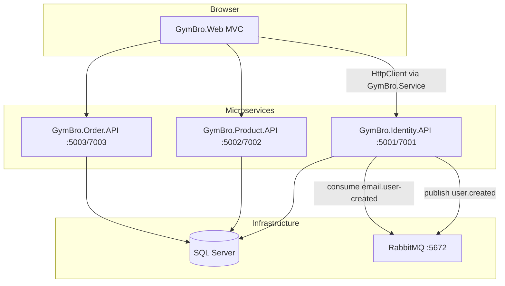

# WORLD.md — GymBro Project Context

> **Mục đích file này:** Khi đưa repo cho AI khác (Cursor, ChatGPT, Codex…), hãy **đính kèm hoặc @ mention file `WORLD.md`** để AI nắm toàn bộ ngữ cảnh dự án trước khi code thêm tính năng.
>
> **Repo gốc:** `d:\lam`  
> **Solution chính:** `GymBro-multi.sln`  
> **Ngôn ngữ / stack:** C# .NET 8, ASP.NET Core MVC + Web API, EF Core, SQL Server, RabbitMQ, MailKit SMTP

---

## 1. GymBro là gì?

**GymBro** là website thương mại điện tử (tiếng Việt) bán **đồ gym**: thiết bị, phụ kiện, thực phẩm bổ sung.

| Nhóm người dùng | Chức năng |
|-----------------|-----------|
| **Khách (User)** | Xem sản phẩm, tìm kiếm, giỏ hàng, checkout, đơn hàng, wishlist, đánh giá, đăng nhập/Google |
| **Admin** | CRUD sản phẩm, danh mục, kho, NCC, đơn hàng, thanh toán, user, dashboard |

Dự án đang **chuyển từ monolith sang microservices (SOA)**. Lớp **Web + GymBro.Service** đã gọi nhiều API, nhưng **backend microservice chưa implement hết** — xem mục 8.

---

## 2. Cấu trúc solution (bắt buộc đọc)

```
GymBro-multi.sln
├── GymBro.Core              # Entity domain (Product, User, Order…)
├── GymBro.Infrastructure    # GymBroDbContext, OrderDbContext, migrations, ProductRepository
├── GymBro.Contracts         # DTO, ServiceResponse, integration events
├── GymBro.Service           # HttpClient gọi các API (Web chỉ dùng lớp này, không EF trực tiếp)
├── GymBro.Identity.API      # Auth, user DB, RabbitMQ publish, email welcome
├── GymBro.Product.API       # Product + Category API
├── GymBro.Order.API         # Order domain (hiện chỉ có CartController)
└── GymBro.Web               # MVC storefront + admin UI
```

### Thư mục KHÔNG nằm trong solution chính (tham khảo / legacy)

| Path | Ghi chú |
|------|---------|
| `d:\lam\code\` | Bản **monolith cũ đầy đủ hơn** (`GymBro.Application`, `Features/`, nhiều service Infrastructure). Dùng để tham khảo logic đã làm sẵn. |
| `d:\lam\GymBro.API\` | API monolith + JWT, được **docker-compose gốc** build — không phải kiến trúc SOA đang migrate |
| `d:\lam\Producing\` | Solution mẫu khác, **không liên quan** GymBro |

**Quy tắc cho AI:** Code tính năng mới ở **root** (`d:\lam\GymBro.*`), không copy nguyên từ `code/` trừ khi port có chủ đích.

---

## 3. Kiến trúc runtime



### Port mặc định (`launchSettings.json`)

| Service | HTTP | HTTPS |
|---------|------|-------|
| Identity.API | 5001 | 7001 |
| Product.API | 5002 | 7002 |
| Order.API | 5003 | 7003 |
| GymBro.Web | 5101 | 7282 |

`GymBro.Web/appsettings.json`:

```json
"ServiceUrls": {
  "IdentityApi": "http://localhost:5001",
  "ProductApi": "https://localhost:7002",
  "OrderApi": "https://localhost:7003"
}
```

---

## 4. Từng layer — AI cần sửa file nào?

### 4.1 `GymBro.Core` — Domain entities

Không reference project khác. Entity chính:

- `User`, `Product`, `Category`, `Order`, `OrderDetail`, `CartItem`
- `Payment`, `PaymentMethod`, `Review`, `Wishlist`
- `Supplier`, `PurchaseOrder`, `PurchaseOrderDetail`, `InventoryTransaction`
- `OrderStatus` — hằng tiếng Việt: `"Chờ xử lý"`, `"Đang giao"`, `"Đã giao"`, `"Đã hủy"`, …

### 4.2 `GymBro.Infrastructure`

- `GymBroDbContext` — toàn bộ `DbSet` commerce
- `OrderDbContext` — subset order/cart/payment/inventory
- Migrations: `GymBro.Infrastructure/Migrations/`
- Product.API và Order.API có **migration riêng** trong project API

### 4.3 `GymBro.Contracts`

- DTO trong `DTOs/` và `DTOs.cs`
- `ServiceResponse<T>` pattern (nếu có)
- Events: `Events/UserCreatedIntegrationEvent.cs`, routing key `user.created`

### 4.4 `GymBro.Service`

Mỗi service = `HttpClient` + interface `I*Service`. Web **chỉ** inject các interface này.

| Service | Base URL config | Gọi API prefix |
|---------|-----------------|----------------|
| `IdentityService`, `UserService` | IdentityApi | `api/auth/*` |
| `ProductService`, `CategoryService`, `ReviewService`, `SupplierService` | ProductApi | `api/product`, `api/category`, `api/review`, `api/supplier` |
| `OrderService`, `PaymentService`, `WishlistService` | OrderApi | `api/order`, `api/cart`, `api/payment`, `api/wishlist` |

**Thêm endpoint mới:** (1) DTO trong Contracts → (2) method trong `I*Service` + `*Service.cs` → (3) controller API tương ứng → (4) MVC controller + View nếu cần UI.

### 4.5 Các API microservice

**Identity.API** (`Controllers/AuthController.cs`, route `api/auth`):

| Endpoint | Trạng thái |
|----------|------------|
| POST `register`, `login`, `forgot-password`, `reset-password` | Có |
| GET `has-admin` | Có |
| POST `google` | Có |
| GET `users`, POST `create-admin` | Web gọi qua `IdentityService` / `UserService` — **cần kiểm tra đã implement chưa** |

JWT được tạo trong login nhưng **Web không gửi Bearer token**; Web dùng **Session**.

**Product.API:**

| Controller | Route | Endpoints |
|------------|-------|-----------|
| `ProductController` | `api/product` | GET, GET `{id}`, POST, PUT `{id}`, DELETE `{id}` |
| `CategoryController` | `api/category` | CRUD đầy đủ |

Chưa có: `api/review`, `api/supplier`, `api/product/{id}/adjust-stock` (Web/Service đã gọi).

**Order.API:**

| Controller | Route | Endpoints |
|------------|-------|-----------|
| `CartController` | `api/cart` | GET `my-cart`, POST `add` (có `[Authorize]`) |

Chưa có: toàn bộ `api/order`, `api/payment`, `api/paymentmethod`, `api/wishlist`.

**Lỗi kiến trúc cần nhớ:** `CartController` có thể inject `GymBroDbContext` trong khi `Program.cs` chỉ register `OrderDbContext` — sửa trước khi test cart API.

### 4.6 `GymBro.Web` — MVC

**Controllers** (`GymBro.Web/Controllers/`):

| Controller | Vai trò | Base class |
|------------|---------|------------|
| `HomeController` | Trang chủ, sản phẩm nổi bật | Controller |
| `ProductsController`, `CategoriesController` | Admin catalog | `BaseAdminController` |
| `CartController`, `OrdersController`, `OrderDetailsController` | Mua hàng | Mixed |
| `AccountController` | Login, register, Google, profile | Controller |
| `AdminController` | Dashboard thống kê | `BaseAdminController` |
| `UsersController`, `PaymentsController`, `PaymentMethodsController` | Admin | `BaseAdminController` |
| `InventoryController`, `SupplierController` | Admin kho/NCC | `BaseAdminController` |
| `ReviewsController`, `AdminReviewsController`, `WishlistController` | Review/wishlist | Mixed |
| `AdminSetupController` | Tạo admin lần đầu | Controller |

**Admin guard** — mọi controller admin kế thừa:

```csharp
// BaseAdminController.cs — đọc UserDto từ Session, Role phải == "Admin"
var user = context.HttpContext.Session.GetObject<UserDto>("User");
```

Helper session: `GymBro.Web/Helpers/SessionExtensions.cs`.

**Views:** `GymBro.Web/Views/{Controller}/{Action}.cshtml`. Layout admin: `_LayoutAdmin.cshtml`.

---

## 5. Xác thực & phân quyền

| Tầng | Cơ chế |
|------|--------|
| Identity.API | BCrypt password, trả JWT (claims: NameIdentifier, Name, Role) — config `Jwt:Key`, `Issuer`, `Audience` |
| GymBro.Web | **ASP.NET Session** — lưu `UserDto` key `"User"`, có thể lưu `"JWToken"` nhưng HttpClient **không attach** token |
| Phân quyền | `User.Role`: `"User"` (mặc định) hoặc `"Admin"` |
| Google OAuth | `POST api/auth/google` + `Google:ClientId` trong appsettings Web |

Sau login: Admin → `Products/Index`; User → `Home/Index`.

**Pitfall:** `CartController.PlaceOrder` dùng `User.FindFirst(ClaimTypes.NameIdentifier)` trong khi auth là Session — checkout có thể lỗi; nên đọc `Session.GetObject<UserDto>("User")`.

---

## 6. Messaging (RabbitMQ)

| Thành phần | Chi tiết |
|------------|----------|
| Exchange | `gymbro.events` |
| Routing key | `user.created` (`IntegrationEventRoutingKeys.UserCreated`) |
| Event | `UserCreatedIntegrationEvent` — UserId, Username, Email, FullName, CreatedAt, RegistrationSource, **SendWelcomeEmail** |
| Publisher | `RabbitMqIntegrationEventPublisher` (Identity.API) — khi register / Google register |
| Consumer | `UserCreatedWelcomeEmailConsumer` → queue `email.user-created` → `SmtpWelcomeEmailSender` (MailKit) |
| Queue chưa có consumer | `order.user-created` (khai báo trong `rabbitmq/definitions.json`) |

Config: `GymBro.Identity.API/appsettings.json` — sections `RabbitMQ`, `Smtp`.

**Không commit password SMTP thật** — dùng `appsettings.Development.json` local hoặc User Secrets.

---

## 7. Database

- **Engine:** SQL Server 2022 (EF Core 8)
- **Docker** (`docker-compose.yml`): container `db`, port 1433, SA password `MatKhauSieuManh123!`, DB `GymBroDB`
- **Local appsettings** thường dùng password `GymBro@2024Password` — **phải khớp** với SQL đang chạy

| API | Database name (dev) |
|-----|---------------------|
| Identity.API | `GymBroDB` |
| Product.API | `GymBro_Product` |
| Order.API | `GymBro_Order` |

Cả 3 DB đều có migration tạo schema gần **full** — đây là smell khi tách service; dữ liệu **không tự đồng bộ** giữa DB.

**Bảng chính:** Users, Categories, Products, Orders, OrderDetails, CartItems, Payments, PaymentMethods, Reviews, Wishlists, Suppliers, PurchaseOrders, PurchaseOrderDetails, InventoryTransactions.

User lưu custom table `Users` (BCrypt), **không** dùng ASP.NET Identity trong Identity.API hiện tại.

---

## 8. Bảng đối chiếu: Web mong đợi vs API thực tế

Dùng bảng này khi AI được yêu cầu “làm tính năng X” — biết phải code ở API nào.

| Tính năng | Web UI | GymBro.Service | API backend |
|-----------|--------|----------------|-------------|
| Sản phẩm / danh mục | Có | Có | **Product.API — OK** |
| Auth, Google | Có | Có | **Identity.API — phần lớn OK** |
| Email chào mừng | — | — | **Identity.API + RabbitMQ — OK** |
| Giỏ session (khách) | Có | Một phần | Web cart session; API cart **chưa hoàn chỉnh** |
| Đơn hàng / checkout | Views có | `OrderService` gọi `api/order/*` | **Order.API — CHƯA CÓ** |
| Thanh toán | Có | `PaymentService` | **CHƯA CÓ** |
| Wishlist | Có | `WishlistService` | **CHƯA CÓ** |
| Review | Có | `ReviewService` | **CHƯA CÓ** |
| Supplier | Có | `SupplierService` | **CHƯA CÓ** |
| Điều chỉnh kho | Có | `adjust-stock` | **CHƯA CÓ** |
| Purchase order | Views có | — | **CHƯA CÓ controller** |
| Quản lý user admin | Có | `api/auth/users` | **Kiểm tra Identity.API** |

**Hướng migrate điển hình:** Mở `code/GymBro.Infrastructure` hoặc `code/GymBro.Application` → port logic sang controller API tương ứng ở root.

---

## 9. Docker

`docker-compose.yml` (root) chạy:

- `db` — SQL Server
- `rabbitmq` — 5672, management UI 15672
- `gymbro_api` — build từ **GymBro.API** (monolith), port 5001
- `gymbro_web` — GymBro.Web, port 5000

**Không** tự chạy 3 microservice Identity/Product/Order. Chạy SOA local = `dotnet run` từng project (mục 10).

`code/docker-compose.yml` có thêm migrator, healthcheck — tham khảo khi harden deploy.

---

## 10. Chạy local (SOA đầy đủ)

```powershell
cd d:\lam

# 1. Infrastructure
docker compose up -d db rabbitmq

# 2. Migration (chạy từng cặp project/startup)
dotnet ef database update --project GymBro.Infrastructure --startup-project GymBro.Identity.API
dotnet ef database update --project GymBro.Product.API --startup-project GymBro.Product.API
dotnet ef database update --project GymBro.Order.API --startup-project GymBro.Order.API

# 3. APIs (3 terminal)
dotnet run --project GymBro.Identity.API
dotnet run --project GymBro.Product.API
dotnet run --project GymBro.Order.API

# 4. Web
dotnet run --project GymBro.Web
# Mở https://localhost:7282 hoặc http://localhost:5101
```

**Tạo admin lần đầu:** `/AdminSetup/CreateAdmin` (cần endpoint `api/auth/create-admin`) hoặc insert trực tiếp `Users` với `Role = 'Admin'`.

**Swagger:** Identity `http://localhost:5001/swagger`, Product `:5002`, Order `:5003`.

---

## 11. Quy ước code (AI phải tuân theo)

1. **Ngôn ngữ UI / message:** Tiếng Việt.
2. **Comment trong code:** Thường tiếng Việt (`// Đăng ký`, `// Nhóm 1: Identity API`).
3. **API route:** Số ít — `api/product`, `api/category` (không `api/products`).
4. **Namespace API:** Một số controller dùng `Product.API.Controllers` dù project là `GymBro.Product.API` — giữ nhất quán file đang sửa.
5. **Admin MVC:** Kế thừa `BaseAdminController`, không tự check role rải rác.
6. **Web không dùng DbContext** — chỉ gọi `GymBro.Service`.
7. **DTO cross-service:** Luôn đặt trong `GymBro.Contracts`.
8. **Thay đổi schema:** Migration đúng project (Infrastructure hoặc API có DbContext riêng).
9. **Phạm vi diff:** Tối thiểu, không refactor lan man; không copy cả thư mục `code/` nếu không cần.
10. **Secrets:** Không hardcode SMTP/JWT vào commit; dùng Development config hoặc env.

---

## 12. Playbook: thêm tính năng mới cho AI

### Ví dụ: “Thêm API wishlist”

1. Đọc `GymBro.Service/Services/WishlistService.cs` — xem URL đang gọi.
2. Tham khảo logic cũ: `code/GymBro.Infrastructure` hoặc `code/GymBro.API` (grep `Wishlist`).
3. Tạo `WishlistController` trong `GymBro.Order.API` (hoặc Product nếu team quyết định bounded context).
4. Dùng `OrderDbContext` / `GymBroDbContext` thống nhất với `Program.cs` của API đó.
5. Thêm DTO vào `GymBro.Contracts` nếu thiếu.
6. Cập nhật `GymBro.Web/Controllers/WishlistController.cs` nếu cần — thường đã có, chỉ cần API chạy được.
7. Test: chạy Order.API + Web, đăng nhập session User.

### Ví dụ: “Hoàn thiện checkout”

1. Implement `POST api/order/place-order` trong Order.API (theo `CheckoutDto`).
2. Sửa `CartController` Web đọc `userId` từ Session, không từ Claims.
3. Trừ tồn kho — có thể gọi Product API `adjust-stock` hoặc event sau order placed.
4. Cân nhắc JWT giữa Web→API hoặc API key nội bộ — hiện **chưa có** chuẩn auth service-to-service.

### Ví dụ: “Consumer tạo giỏ khi user mới”

1. Subscribe queue `order.user-created` trong Order.API.
2. Deserialize `UserCreatedIntegrationEvent`.
3. Tạo `CartItem` / cart mặc định cho `UserId`.

---

## 13. Công việc gần đây (git / branch)

Các file thường đang chỉnh (welcome email + cart SOA):

- `GymBro.Contracts/Events/UserCreatedIntegrationEvent.cs` — flag `SendWelcomeEmail`
- `GymBro.Identity.API` — AuthController, SmtpWelcomeEmailSender, UserCreatedWelcomeEmailConsumer, RabbitMQ
- `GymBro.Order.API/Controllers/CartController.cs`
- `GymBro.Service/Services/ProductService.cs` — `adjust-stock`
- `GymBro.Web` — AdminController, Cart/Index.cshtml

Arc: **tách monolith + email async**, Web/Service đi trước API.

---

## 14. Pitfalls & việc chưa làm (đừng assume đã xong)

| Vấn đề | Hành động gợi ý |
|--------|-----------------|
| Nhiều API endpoint Web gọi nhưng 404 | Implement controller trước khi sửa View |
| JWT không propagate | Thêm `DelegatingHandler` gắn Bearer từ Session, hoặc bỏ JWT dùng API key nội bộ |
| 3 database riêng | Thống nhất 1 DB giai đoạn dev, hoặc thiết kế sync/event |
| Docker compose ≠ SOA | Chạy `dotnet run` từng API khi dev microservices |
| `order.user-created` không consumer | Implement trong Order.API |
| Product.API `[Authorize]` nhưng không `AddAuthentication` | Thêm JwtBearer hoặc bỏ Authorize tạm dev |
| Identity.API reference Web/Order/Product | Tránh circular dependency khi refactor |
| `GymBro.API` monolith | Legacy; không thêm feature mới trừ khi chủ đích |

---

## 15. File quan trọng — bookmark

| Mục đích | Path |
|----------|------|
| Solution | `GymBro-multi.sln` |
| Web startup + DI HttpClient | `GymBro.Web/Program.cs` |
| DbContext đầy đủ | `GymBro.Infrastructure/GymBroDbContext.cs` |
| Auth API | `GymBro.Identity.API/Controllers/AuthController.cs` |
| Product API | `GymBro.Product.API/Controllers/ProductController.cs` |
| Order API | `GymBro.Order.API/Controllers/CartController.cs` |
| Session helper | `GymBro.Web/Helpers/SessionExtensions.cs` |
| Integration event | `GymBro.Contracts/Events/UserCreatedIntegrationEvent.cs` |
| RabbitMQ defs | `rabbitmq/definitions.json` |
| Docker | `docker-compose.yml` |
| Legacy tham khảo | `code/GymBro.Web/`, `code/GymBro.Infrastructure/` |

---

## 16. Prompt mẫu khi giao việc cho AI khác

Copy và điền phần in đậm:

```
Bạn là dev .NET cho dự án GymBro. Đọc WORLD.md trong repo trước.

Bối cảnh: SOA với GymBro.Web (MVC) gọi Identity/Product/Order API qua GymBro.Service.
Solution: GymBro-multi.sln tại root d:\lam. KHÔNG sửa thư mục code/ trừ khi port logic.

Nhiệm vụ: **[mô tả tính năng]**

Ràng buộc:
- Tuân convention WORLD.md mục 11
- Thay đổi tối thiểu; implement API trước nếu Service đã gọi endpoint
- UI tiếng Việt
- Không commit secrets

Sau khi code: liệt kê file đã sửa, lệnh test, endpoint mới.
```

---

*Cập nhật lần cuối: 2026-05-25 — sinh từ khảo sát repo `d:\lam`.*
